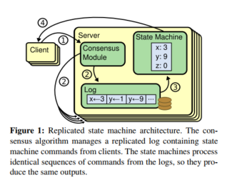
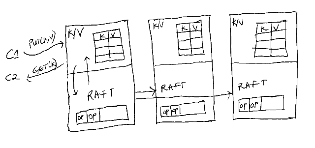
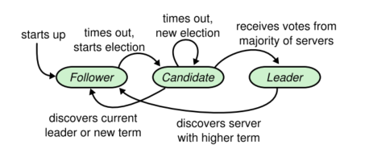
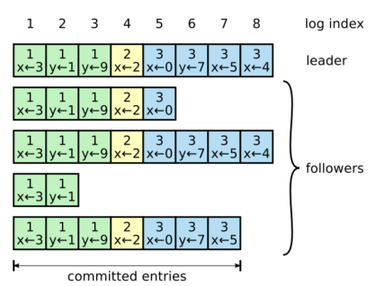
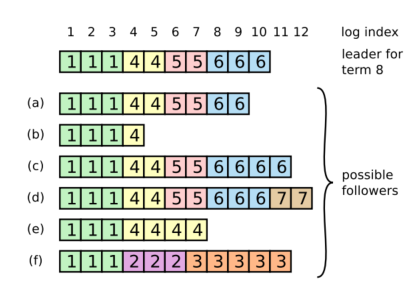

# MIT 6.824: Lectures 6 & 7 - Fault Tolerance (Raft)

One common pattern in earlier distributed systems is that they all rely on a single entity to
make the key decisions. For example:

* In MapReduce, a single master is responsible for organizing the computation among the worker
  nodes.
* A master is also responsible for picking the primary replica for a chunkserver in GFS.
* In VMware FT, an atomic test-and-set operation on a single shared disk is used in choosing a
  new leader to prevent split-brain.

While this has the advantage of making it easier for the system to come to a decision, the
downside of this approach is that the entity is now a single point of failure. If the entity is
down for whatever reason, the system may not be able to make any meaningful progress without
manual intervention from an operator.

Ideally, we would want a more fault-tolerant system that can withstand the loss of at least one
node, even if that node is the one making critical decisions at the time. Such a system would
need a mechanism for the other nodes in the cluster to automatically *agree* on which one of
them should take over as the next leader.

It turns out that getting all the nodes in a cluster to agree on a decision is a hard problem
in distributed systems. The main difficulty lies in the fact that it is impossible to
distinguish between when a node has crashed, and when there is a network fault. These two
problems have same symptom, which is that no response will be received from the node. If a node
is wrongly declared dead, it may still be able to receive and execute requests from clients,
which may lead to inconsistencies between the nodes. The other nodes may need to decide on:

* What node should take over as the leader/master in the cluster when there's a failure; if two
  or more nodes think that they are the master, we could end up with a split-brain situation.
* What client requests to execute; if two nodes decide differently, a client could see
  inconsistent results.

This problem of getting multiple nodes to agree has led to the development of *consensus*
algorithms. Distributed consensus is the ability for components in a distributed system to
reach agreement even in the presence of failures and an unreliable network.
[Paxos](http://paxos.systems/index.html) and [Raft](https://raft.github.io/) are two of the
most popular consensus algorithms today. This post will focus on the Raft algorithm, which
tackles the consensus problem. Its original paper can be found
[here](https://pdos.csail.mit.edu/6.824/papers/raft-extended.pdf).

**Table of Contents**

* [Raft Paper Summary](#raft-paper-summary)
  * [Replicated State Machines](#replicated-state-machines)
  * [Raft Overview](#raft-overview)
    * [Why Use Logs?](#why-use-logs)
    * [Server States](#server-states)
    * [Raft Uses Terms](#raft-uses-terms)
  * [How is a leader elected?](#how-is-a-leader-elected)
    * [Election Timeouts Are Randomized](#election-timeouts-are-randomized)
    * [Any Two Majorities Must Overlap in At Least One Server](#any-two-majorities-must-overlap-in-at-least-one-server)
  * [How does log replication work?](#how-does-log-replication-work)
    * [What happens if the leader crashes?](#what-happens-if-the-leader-crashes)
  * [Why is it safe for a new leader to overwrite its follower's logs?](#why-is-it-safe-for-a-new-leader-to-overwrite-its-followers-logs)
  * [What happens when a follower or candidate crashes?](#what-happens-when-a-follower-or-candidate-crashes)
  * [How do we choose the right election timeout?](#how-do-we-choose-the-right-election-timeout)
  * [How does Raft tame its logs?](#how-does-raft-tame-its-logs)
* [Conclusion](#conclusion)
* [Further Reading](#further-reading)

## Raft Paper Summary

Before the creation of the Raft algorithm, Paxos had almost solely dominated the landscape of
consensus algorithms. The problem with Paxos, however, is that it is quite a challenge to
understand it. This challenge is what led to the creation of Raft. The authors had a desire to
develop a consensus algorithm that was not only practical but was also understandable. Their
primary goal in the creation of the algorithm was *understandability.*

One of the approaches the authors took to create an understandable algorithm was to decompose
the consensus problem into separate parts:

* leader election
* log replication, and
* safety.

These parts will be discussed separately below.

### Replicated State Machines

The general idea for the replicated state machine approach is that if two state machines are
fed the same input operations in the same order, their outputs will be the same.

A replicated log is typically used to implement replicated state machines. Each server
maintains its log, which contains a series of commands that its state machine must execute in
order. These logs must be kept consistent across all the servers. Consistency here means that
all the logs must have the same commands in the same order.

 

The job of a consensus algorithm is to keep this replicated log consistent. Each server has a
consensus module for managing its log. The consensus module on a server is responsible for
adding client commands to the log and communicating with the consensus modules on the other
servers to ensure that their logs *eventually* contain the same commands in the same order.

Practical consensus algorithms must not violate the following properties:

* *Safety:* That is, they must return a correct result under all
  [non-Byzantine](https://timilearning.com/posts/ddia/part-two/chapter-8/#byzantine-faults)
  conditions. These conditions include packet losses, network delays, partitions, etc. Any
  value decided on by a server must have been proposed by another server, it is not enough for
  the server to just always return 'null'.
* *Availability:* Consensus algorithms must be fully functional, provided that the majority of
  the servers are operational and can communicate with clients and each other. A cluster of
  seven servers can tolerate the failure of any three servers. A minority of slow or failed
  servers should not impact the overall performance of the system.
* They do not depend on *timing* to ensure that logs are consistent.
  [Clocks are unreliable](https://timilearning.com/posts/ddia/part-two/chapter-8/#unreliable-clocks),
  and consensus algorithms must not rely on them to determine the right order of events.

### Raft Overview

Raft works by electing a single leader among the servers, which then becomes responsible for
managing the log replication. The leader is responsible for accepting client requests and
deciding where log entries should be placed, without having to consult other servers. When the
current leader fails, Raft includes a protocol for electing a new leader to take over.

As stated earlier, Raft breaks down consensus into three independent subproblems:

* **Leader election**: A new leader must be chosen when the old one fails.
* **Log Replication:** The leader accepts log entries from clients and is responsible for
  replicating them to the other servers.
* **Safety:** If a log entry has been applied at an index on one server, it must be applied at
  the same index on all the other servers.

 

Figure 2: An example of an application where Raft could be used is a key-value database, as
shown above. Client requests are converted to log entries on a leader, which are then\
replicated on the other servers by the Raft module. The state machine converts those log
entries into records in the key-value store. 

#### Why Use Logs?

A log is an append-only sequence of records used as a storage abstraction in many distributed
systems today. Some of the benefits of using a log include:

* *Ordering*: The log assigns an order to all its records. This helps the replicas agree on a
  single execution order of commands.
* A log stores tentative commands until they are committed.
* A log also keeps a persistent state of all the commands that have been executed by the state
  machine. By doing this, the current state of the application can be recreated at any time by
  replaying the log commands.

#### Server States

A server is always in one of three states: *leader, follower,* or *candidate.* A leader
receives requests from clients and communicates them with the other servers. A follower is
passive; it only receives log entries from the leader and votes in elections. Any requests from
a client to a follower will be redirected to the leader. The candidate state is used for leader
elections.

 

Figure 3 - "Server states. Followers only respond to requests from other servers. If a follower
receives no communication, it becomes a candidate and initiates an election. A candidate that
receives votes from a majority of the full cluster becomes the new leader. Leaders typically
operate until they fail."

#### Raft Uses Terms

Time in Raft is divided into *terms* which can be of arbitrary length. Each term begins with an
election and has at most one leader. Terms act as a form of a logical clock in a system. Some
other key things to note about terms are as follows:

* Terms are labeled with consecutive integers.
* Each server stores its current term number and whenever servers communicate, they exchange
  term numbers.
* If a server's current term is smaller than the other servers' own, it updates its term to the
  larger value.
* If a *candidate* or *leader* detects that its term is smaller than another server's own, it
  reverts to *follower* state.

The servers in Raft communicate through
[RPCs](https://timilearning.com/posts/mit-6.824/lecture-2-rpc-and-threads/#remote-procedure-call-rpc).
There are two main RPC methods involved here:

1. **AppendEntries RPC**: This method is invoked by a leader to replicate its log entries to
   the other servers. It includes the leader's term, the new log entries, and identifiers for
   where to place the entries, among other things.
2. **RequestVote RPC**: This is invoked by candidates to gain votes from the other servers. It
   includes the candidate's term, identifier, and some other items which will be discussed
   later.

### How is a leader elected?

A leader sends periodic *heartbeat* messages to its followers to maintain its authority. These
heartbeat messages are in the form of AppendEntries RPCs which contain no log entry. If a
follower has not received any communication from the leader within a specified *election
timeout,* it will transition to candidate state. The follower does this because it assumes
there is no leader in the cluster at present, and so it begins an election to choose a new one.

The first step that a follower takes after becoming a candidate is to increase its term number.
After doing that, it votes for itself and sends an RPC (including its term number) to all the
other servers in parallel to request votes from them. A candidate will remain in its state
until any of the following conditions is met:

1. It wins the election.
2. Another server establishes itself as the leader.
3. There's a period with no winner of the election.

For a candidate to win an election, it must have received votes from the *majority* of the
servers in the cluster. Note that the majority is out of all the servers in the cluster, not
just the live ones. A server can vote for at most one candidate in a given term, and the
decision is made on a first-come-first-served basis. The winning candidate in a term then
becomes a leader and immediately sends out *heartbeat* messages to the other servers to
establish its authority. Note that there is another restriction on how servers can vote which
will be discussed later.

It is also possible that while waiting for votes, a candidate receives an AppendEntries RPC
from another server that claims to be the leader. If the supposed leader's term included in the
RPC is greater than or equal to the candidate's term, the candidate will accept that the leader
is legitimate and then transition back to follower state. Otherwise, if the leader has a
smaller term than the candidate's term, the candidate will reject the RPC and continue in its
state.

Lastly, it's possible that a candidate neither wins nor loses an election. This can happen if
there are many candidates at the same time, and the votes get split equally among them. If this
happens, the candidates will time out, increase their terms, and then begin another round of
the election process. Raft takes an extra measure to prevent *split votes* from happening
indefinitely, which will be discussed next.

#### Election Timeouts Are Randomized

Raft takes measures to prevent split votes in the first place by ensuring that the election
timeout of each server is randomly chosen from a fixed interval. This way, the probability that
two or more servers time out at the same time and become candidates is reduced. A single
server can then win an election and send heartbeat messages to the other servers before their
election timeout expires.

Randomized timeouts are also used to handle split votes. Each candidate's election timeout is
restarted at the start of an election, and the timeout must elapse before it can start another
election. This reduces the probability of another split vote in the new election.

#### Any Two Majorities Must Overlap in At Least One Server

All of Raft's key decisions rely on getting some confirmation from majority of the servers in
the cluster. The insight here is that if there is a partition in the cluster i.e., one or more
nodes cannot communicate with the other set of nodes, at most one of the partitions can have
the majority. In addition, any subsequent majorities *must* overlap with the previous ones in
at least one server. This is how Raft is able to ensure that a term has at most one leader and
prevent a split-brain situation. If we have candidates from separate partitions that cannot
communicate, only one of them will be able to gain a majority of votes. There is no chance of
two candidates in separate partitions gaining a majority for the same term.

A Raft cluster is typically made up of an odd number of servers. This helps to improve fault
tolerance in the cluster. For example, a cluster of 4 nodes needs 3 nodes to make a decision,
and a cluster of 5 nodes also needs the same amount of nodes. This means that we can tolerate
more failures and still make progress in the cluster. More generally, a cluster of *2f + 1*
servers can tolerate *f* failed servers.

Systems that rely on the overlap of majority set of servers for operation are referred to as
*quorum* systems.

### How does log replication work?

A leader is responsible for receiving client requests once it has been elected. These client
requests contain commands that must be replicated to the servers in the cluster.

When a request comes in, the leader creates a new log entry containing that command and appends
the entry to its log. It then sends AppendEntries RPCs in parallel to its followers. An entry
will only be considered as *committed* when it has been safely replicated on the majority of
its followers. Once an entry is marked as committed, it must be durably persisted on all the
followers. If a follower crashes or there is a network fault that drops packets to the
follower, the leader will keep retrying the request indefinitely until the follower receives
the log entry. All followers *must* eventually store committed log entries. When an entry is
committed, it can then be executed by the state machine.

 

Figure 4 - "Logs are composed of entries, which are numbered sequentially. Each entry contains
the term in which it was created (the number in each box) and a command for the state machine.
An entry is considered committed if it is safe for that entry to be applied to state machines"

The protocol for log replication in Raft is described as follows:

* Each log entry contains a command as well as the term number when the entry was received by
  the leader. An entry is also identified by an index, which is its position in the log.
* A leader keeps track of the highest entry that it has committed and includes that index in
  its future AppendEntries RPCs. Note that when the leader commits the entry at an index, that
  also commits all the preceding entries in its log. Followers apply entries to their state
  machines once they are notified that the entries have been committed by the leader.
* To maintain consistency in the logs, Raft ensures that the following properties are met: 
  * If two entries in different logs have the same index and term, then they store the same
    command.
  * If two entries in different logs have the same index and term, then the logs are identical
    in all preceding entries
* These properties constitute what is known as the *Log Matching* property. The first property
  is guaranteed by the fact that a leader will only create one entry at a particular log index
  with a given term, and the position of a log entry will never change.
* Raft performs a consistency check with the AppendEntries RPC to guarantee the second property
  above. The leader always includes the index and term of the log entry that immediately
  precedes the new entries when it sends AppendEntries RPCs to its followers. When a follower
  receives the RPC, if it does not contain an entry with the same index and term from the
  leader, it will refuse the entry. If an entry is not refused, it means that the follower's
  log is identical to the leader's log up through the new entries.

#### What happens if the leader crashes?

During normal operations, the protocol described above helps the leader and the followers'
logs to remain consistent. However, leader crashes can result in inconsistencies. These
inconsistencies can then be compounded by subsequent leader and follower crashes.

The figure below describes how inconsistencies between the logs can play out.

 

Figure 5 - Possible inconsistencies in the logs of Raft servers.

It is possible that any of the scenarios (a-f) in Figure 5 could happen in follower logs when
the leader at the top is elected. Each box represents a log entry and the number in a box is
the term of the entry. In this figure, we see that a follower may be missing entries (as in a
and b), may have extra uncommitted entries (c-d), or both scenarios (e-f). Quoting the paper:

> *Scenario (f) could occur if that server was the leader for term 2, added several entries to
>its log, then crashed before committing any of them; it restarted quickly, became leader for
>term 3, and added a few more entries to its log; before any of the entries in either term 2 or
>term 3 were committed, the server crashed again and remained down for several terms.*

Raft handles inconsistencies by forcing the followers' log to duplicate the leader's, meaning
that conflicting entries in a follower's log can be overwritten by the entries in the leader's
log. To make the logs between a leader and follower consistent, the leader first finds the
latest index at which their logs are identical, deletes all the entries in the follower's log
after that index, and then sends the follower the entries in its own log that come after that
point.

### Why is it safe for a new leader to overwrite its follower's logs?

Raft places a restriction on what servers can be elected as a leader with the *Leader
Completeness Property*, which states that:

> *The leader for any given term must contain all the entries committed in previous terms.*

It is able to enforce this because the RequestVote RPC contains information about the
candidate's log, and a voter will deny a candidate's vote request if its log is more up-to-date
than the candidate's. Since a candidate must get votes from the majority, at least one node in
the majority must have the latest entries. A log is more up-to-date than another if it has a
higher term number. If the two logs have the same term number, the log with the higher index
entry is the more up-to-date one.

By this restriction, it is safe for a leader to overwrite a follower's log since the leader
will *always* have the latest committed entries. Any uncommitted entries can be safely
discarded because there is no expectation on the client's side that their request has been
executed. Only committed entries guarantee that. Therefore, the server can return an error
message to the client, telling it to retry the requests for the uncommitted entries.

### What happens when a follower or candidate crashes?

When a follower crashes, any RPCs sent to it will fail. These requests are retried indefinitely
until the server restarts and the RPC completes. It is safe for the AppendEntries and
RequestVote RPCs to be retried because they are [idempotent](https://stackoverflow.com/a/1077421/5430313).
For example, a follower can ignore an AppendEntries RPC if the request contains entries that
are already present in its logs. Candidate crashes are handled in the same way.

### How do we choose the right election timeout?

Although Raft does not depend on timing to ensure the correctness of the logs, timing is
important in ensuring that client requests are responded to swiftly. If the election timeout is
too long, the servers might be without a leader for some time, which will delay the time it
takes to respond to a client request.

The timing requirement that a Raft system should maintain is stated in the paper as:

> *broadcast Time \<\< election Timeout \<\< MTBF*

where *broadcast time* is the average time taken by a server to send RPCs to all the servers in
parallel and receive responses from them, and *MTBF* stands for the Mean Time Between Failures
for a single server.

By selecting an election timeout that is significantly greater than the broadcast time, it
means that leaders can reliably send the required heartbeat messages to prevent unnecessary
elections.

In addition, the election timeout should be orders of magnitude less than the average time it
takes for a server to fail. If the MTBF is less than the chosen election timeout, there could
be a delay between when a leader fails and when its followers begin a new election. However,
by selecting a timeout that is based on the MTBF, we can reduce that delay on average.

### How does Raft tame its logs?

To prevent the log from growing indefinitely, which can increase the time it takes for the
state machine to replay a log when it restarts, Raft uses *snapshotting* for log compaction. A
snapshot of the current application's state is written to durable storage, and all the log
entries up to the point of the snapshot are deleted from the log. Each server takes its
snapshots independently, and snapshots are taken when the log reaches a fixed size in bytes.

A snapshot also contains metadata such as the *last included index,* which is the index of the
last entry in the log being replaced by the snapshot, and the *last included term.* These
metadata are kept because of the AppendEntries consistency check for the first log entry after
the snapshot, which needs a previous log entry and term.

## Conclusion

There are a few details missed in this post about how Raft manages the changes to the server in
a cluster, and how client interactions are handled, among others. I do hope, however, that this
post has helped you build some intuition for a consensus algorithm like Raft if you were not
previously familiar. The further reading section contains links to resources with more detail.

## Further Reading

* [In Search of an Understandable Consensus Algorithm (Extended Version)](https://pdos.csail.mit.edu/6.824/papers/raft-extended.pdf)
  by Diego Ongaro and John Ousterhout. The original Raft paper.
* [Raft Consensus Algorithm](https://raft.github.io/) - Site with more Raft resources.
* [The Secret Life of Data](http://thesecretlivesofdata.com/raft/) - Really cool Raft
  visualization.
* [Lecture 6: Raft (1)](https://pdos.csail.mit.edu/6.824/notes/l-raft.txt) and
  [Lecture 7: Raft (2)](https://pdos.csail.mit.edu/6.824/notes/l-raft2.txt) - MIT 6.824 Lecture Notes.
* [The Log: What every software engineer should know about real-time data's unifying abstraction](https://engineering.linkedin.com/distributed-systems/log-what-every-software-engineer-should-know-about-real-time-datas-unifying)
  by Jay Kreps.
