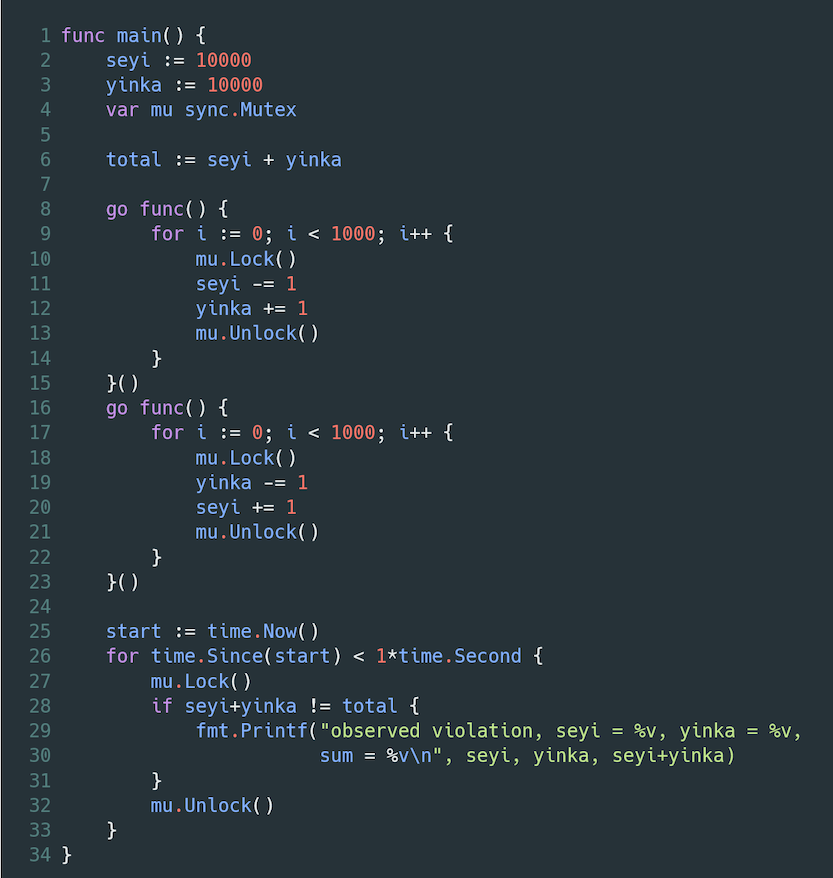
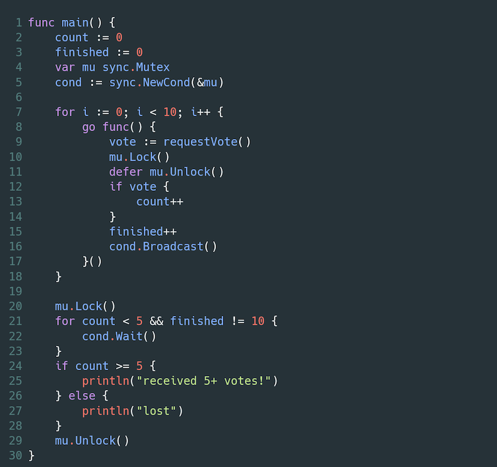
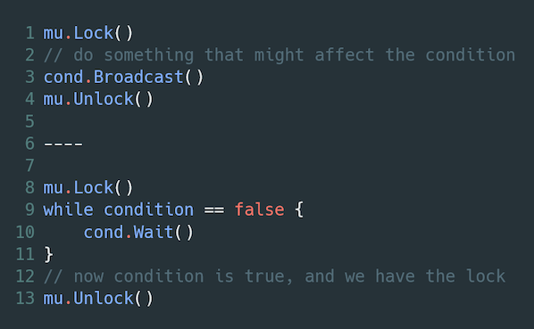
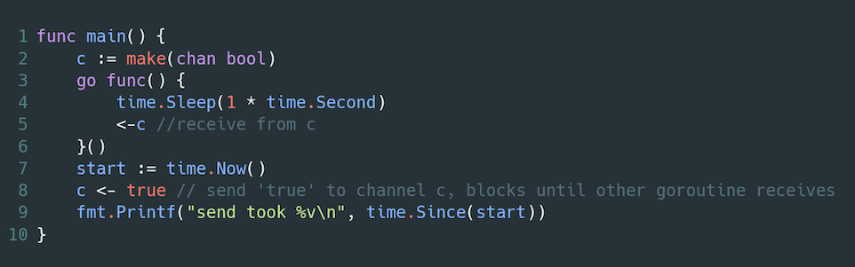

# MIT 6.824: Lecture 5 -  Go, Threads, and Raft

Although 'Raft' is mentioned in the title, a better title for this post is 'Concurrency in Go', as Raft will not be discussed until the next post. Also, unlike other posts on this blog, this one will also feature code samples! Examples of good and bad Go code will be shown for building concurrent applications.

Note that although the examples below are in Go, these concepts apply more generally to other programming languages.

**Table of Contents**

* [Mutexes](#mutexes)
* [Condition Variables](#condition-variables)
* [Channels](#channels)
* [Conclusion](#conclusion)
* [Further Reading](#further-reading)

### Mutexes

Goroutines are lightweight threads in Go. Every Go program has at least one goroutine running, which is the main one from which other goroutines are started. Goroutines execute their functions asynchronously.

In the block below, goroutines are started on line 4 using the *go* keyword. The for loop on line 3 starts 1000 goroutines, each of which increments the counter variable declared on line 2.

Can you spot the bug?

Now, if you wrote a function like above, chances are that you would want and expect the final value of the counter to be equal to 1000. However, when this program is executed, it is highly unlikely that the final value of the counter is 1000.

This is because the counter field is shared by all the goroutines, and we are not protecting access to that variable. For example, if the current value of the counter is 5 and two goroutines try to increment the value at the same time, the value of the counter after the operations will be 6, rather than the 7 we expect after two increments. This is a *race condition,* and a program like this must take care to prevent it.

Go has *mutexes*, which help prevent race conditions when used properly. Mutexes can be used to protect *critical sections* in your code. Critical sections are those blocks of code which should only be accessed by one thread at a time. Those blocks will typically involve accessing shared variables, and protecting them is essential in ensuring that your program runs predictably.

In the block below, the variable *mu* declared on line 3 represents the mutex, and we wrap a lock around the shared counter variable on lines 6-8.

When this program is executed, the final value of the counter will be 1000, as expected.

More generally, *use locks when you want to protect invariants in a concurrent application*, i.e. properties of your application which should always be true. To explain this, let's look at this example below in which we perform operations for two clients of a bank: Seyi and Yinka.

Seyi and Yinka both start the operation with 10,000 in each of their accounts, leading to a total of 20,000 in the bank. In the first goroutine declared on line 8, Seyi transfers money from her account to Yinka's. In the second goroutine on line 19, Yinka transfers money from his account to Seyi's.

An author of a program like this will likely expect the sum of the amount in each account to always be equal to 20,000 — since any amount removed from one account is expected to be transferred to the other immediately.

Can you spot the bug?

When this program is run, the code on line 33 will likely be executed multiple times, highlighting that there were multiple periods where that invariant — that the sum of each accounts' value should equal the initial total value — is observed to be violated.

The problem in this example is that although we have placed locks on each shared variable, locks by themselves are not enough to enforce the invariants in our program. If a section of code must be executed atomically (i.e. all the operations in that section must either execute together or not execute at all), then a lock should wrap around that section.

A modified version of the bank example is shown below. In this example, we see on lines 10-13 and lines 18-21 that locks are wrapped around the critical sections, which will help protect the invariants we are interested in.

### Condition Variables

To introduce condition variables, let's consider this example below.

In this program, we have a for loop on line 6 which starts goroutines from the main goroutine and tries to gain votes from them on line 8. If it wins a vote, the shared *count* variable is incremented. After each vote is cast, the *finished* variable is also incremented.

On line 18, we have a for loop which will prevent the main goroutine from progressing until it has either won at least 5 votes or all 10 goroutines have cast their vote.

Note that we have placed locks to protect our invariants, and this program will indeed execute as we expect. However, on closer observation, the for loop starting on line 18 is not the best use of the CPU's resources. In each iteration, it will obtain a lock, check that the condition is met and then release the lock. The problem is that there is nothing guiding the number of iterations that the loop will undergo before the *break* condition on line 20 is met. This means that there could many unnecessary loop iterations which will each obtain access to the shared variable.

What if there was a way to run an iteration of the loop *only* when it is possible for the break condition to have been met? In the example above, the condition can only be met when the requestVote() call returns. Thanks to *Condition Variables,* we can delay the execution of the loop until it is possible for the break condition to have been met.

This next example illustrates that.

In this example, we have initialized a condition variable on line 5 and passed it the address of the mutex. When the for loop on line 21 is reached and the condition isn't met, we use the *cond.Wait()* method to pause the execution of the main goroutine. A key thing to note is that *cond.Wait() releases the lock being held on mu by the current Goroutine*. This execution pause and lock release will happen until the *cond.Broadcast()* method is executed on line 16.

Any newly cast vote may cause the break condition to be true, and so we use the cond.Broadcast() method to inform all the threads that are waiting on that condition to resume their execution, and try to obtain the lock on the mutex again.

This is a more efficient use of CPU resources than looping continuously without any knowledge of whether the break condition could have been met or not.

The general format when using condition variables is as shown in the pseudocode below.

### Channels

A [Channel](https://tour.golang.org/concurrency/2) is a primitive for communicating between goroutines. The general idea is that one goroutine sends a *message* on the channel, and that message is received from that channel on a separate goroutine.

An example is shown below.

The channel operator is used on lines 5 and 8 to communicate between the goroutines.

Some key things to note about channels in their default usage are as follows:

* Channels have no internal capacity, not even of one. The implication of this is that for every send operation to a channel, there must be a corresponding receive operation, and vice versa.
* Every send operation will block its thread until a receive happens, and vice versa.

Go has buffered channels which may have some internal capacity that corresponds to a user-defined value. With buffered channels, sends are non-blocking until the buffer is full, and receive operations are non-blocking until the buffer is empty.

A major use of channels is for implementing producer/consumer queues.

If you're a Java developer, the [BlockingQueue](https://docs.oracle.com/javase/8/docs/api/java/util/concurrent/BlockingQueue.html) interface is similar to Go Channels, with the [ArrayBlockingQueue](https://docs.oracle.com/javase/8/docs/api/java/util/concurrent/ArrayBlockingQueue.html) being an implementation of a buffered channel, and a [SynchronousQueue](https://docs.oracle.com/javase/8/docs/api/java/util/concurrent/SynchronousQueue.html) being an unbuffered channel.

### Conclusion

We have gone over some Go constructs that will help when building concurrent applications. I've had to make use of some of these in working out the [labs](https://pdos.csail.mit.edu/6.824/labs/lab-mr.html). If you're interested in learning more about concurrency in Go, I would highly recommend checking out [this](https://golang.org/ref/mem) page on the official Go site.

### Further Reading

* [The Go Memory Model](https://golang.org/ref/mem) - Official Documentation
* [Go Concurrency](https://pdos.csail.mit.edu/6.824/notes/l-go-concurrency.txt) - MIT 6.824 Lecture Notes
