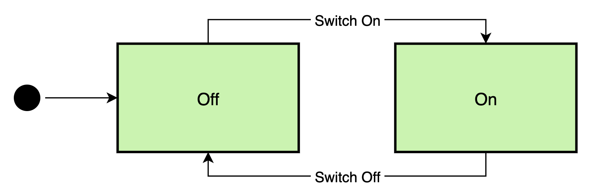

# A Simple State Machine Framework in Go

The concept of [State Machines](https://en.wikipedia.org/wiki/Finite-state_machine) is not new,
and they form the core of a lot of systems that we come across daily, for example, elevators
and traffic lights. State machines make it a lot easy to understand and implement multi-faceted
systems where inputs can be asynchronous and are triggered by multiple sources.

In this post, I will describe the details of a simple state machine framework that I built to
handle a complex scenario to obtain deterministic results.

## Introduction

State machines are of several different types and newer models (like Statecharts) have also
been designed in order to handle extremely complicated systems. The fundamentals of all of
these patterns remain the same i.e. they consist of *states* and *transitions*. For the
purpose of this post, I’ll be using the term *state* to describe the status of the system, and
*event* to describe an input to the FSM (Finite State Machine) that can possibly trigger a
transition from one state to another.

## Light Switch Example



Let’s take a simple example of the light switch state machine that’s shown above. The machine
starts in the *off* state and the user action of switching on i.e. triggering the *switch-on*
event, causes the machine to transition over to the *on* state. And the reverse is also true,
i.e. on triggering the *switch-off* event, the machine then transitiona back from the *on*
state back to the *off* state. Note that triggering the *switch-off* event when in the *off*
state means nothing i.e. the machine doesn’t react to it, and the same is also true when the
*switch-on* event is triggered when the system is in the *on* state.

## The Framework

Here is the framework in Go in under 100 lines of code.

```go
    // ErrEventRejected is the error returned when the state machine cannot process
    // an event in the state that it is in.
    var ErrEventRejected = errors.New("event rejected")

    const (
    	// Default represents the default state of the system.
    	Default StateType = ""

    	// NoOp represents a no-op event.
    	NoOp EventType = "NoOp"
    )

    // StateType represents an extensible state type in the state machine.
    type StateType string

    // EventType represents an extensible event type in the state machine.
    type EventType string

    // EventContext represents the context to be passed to the action implementation.
    type EventContext interface{}

    // Action represents the action to be executed in a given state.
    type Action interface {
    	Execute(eventCtx EventContext) EventType
    }

    // Events represents a mapping of events and states.
    type Events map[EventType]StateType

    // State binds a state with an action and a set of events it can handle.
    type State struct {
    	Action Action
    	Events Events
    }

    // States represents a mapping of states and their implementations.
    type States map[StateType]State

    // StateMachine represents the state machine.
    type StateMachine struct {
    	// Previous represents the previous state.
    	Previous StateType

    	// Current represents the current state.
    	Current StateType

    	// States holds the configuration of states and events handled by the state machine.
    	States States

    	// mutex ensures that only 1 event is processed by the state machine at any given time.
    	mutex sync.Mutex
    }

    // getNextState returns the next state for the event given the machine's current
    // state, or an error if the event can't be handled in the given state.
    func (s *StateMachine) getNextState(event EventType) (StateType, error) {
    	if state, ok := s.States[s.Current]; ok {
    		if state.Events != nil {
    			if next, ok := state.Events[event]; ok {
    				return next, nil
    			}
    		}
    	}
    	return Default, ErrEventRejected
    }

    // SendEvent sends an event to the state machine.
    func (s *StateMachine) SendEvent(event EventType, eventCtx EventContext) error {
    	s.mutex.Lock()
    	defer s.mutex.Unlock()

    	for {
    		// Determine the next state for the event given the machine's current state.
    		nextState, err := s.getNextState(event)
    		if err != nil {
    			return ErrEventRejected
    		}

    		// Identify the state definition for the next state.
    		state, ok := s.States[nextState]
    		if !ok || state.Action == nil {
    			// configuration error
    		}

    		// Transition over to the next state.
    		s.Previous = s.Current
    		s.Current = nextState

    		// Execute the next state's action and loop over again if the event returned
    		// is not a no-op.
    		nextEvent := state.Action.Execute(eventCtx)
    		if nextEvent == NoOp {
    			return nil
    		}
    		event = nextEvent
    	}
    }
```

For the sake of brevity, I’ve skipped over database handling in this post. It’s also quite easy
to wire into this state machine framework.

## Light Switch Example in Go

Here is the same light switch example from above, but this time implemented using the Go
framework. Let’s first define the states and events for the light switch state machine.

```go
    const (
    	Off StateType = "Off"
    	On  StateType = "On"

    	SwitchOff EventType = "SwitchOff"
    	SwitchOn  EventType = "SwitchOn"
    )
```

We can now also define the actions corresponding to each state.

```go
    // OffAction represents the action executed on entering the Off state.
    type OffAction struct{}

    func (a *OffAction) Execute(eventCtx EventContext) EventType {
    	fmt.Println("The light has been switched off")
    	return NoOp
    }

    // OnAction represents the action executed on entering the On state.
    type OnAction struct{}

    func (a *OnAction) Execute(eventCtx EventContext) EventType {
    	fmt.Println("The light has been switched on")
    	return NoOp
    }
```

We can now define our state machine using the previously defined states, events and actions.

```go
    func newLightSwitchFSM() *StateMachine {
      return &StateMachine{
    		States: States{
    			Default: State{
    				Events: Events{
    					SwitchOff: Off,
    				},
    			},
    			Off: State{
    				Action: &OffAction{},
    				Events: Events{
    					SwitchOn: On,
    				},
    			},
    			On: State{
    				Action: &OnAction{},
    				Events: Events{
    					SwitchOff: Off,
    				},
    			},
    		},
    	}
    }
```

Let’s now put our light switch state machine to test.

```go
    func TestLightSwitchStateMachine(t *testing.T) {
    	// Create a new instance of the light switch state machine.
    	lightSwitchFsm := newLightSwitchFSM()

    	// Set the initial "off" state in the state machine.
    	err := lightSwitchFsm.SendEvent(SwitchOff, nil)
    	if err != nil {
    		t.Errorf("Couldn't set the initial state of the state machine, err: %v", err)
    	}

    	// Send the switch-off event again and expect the state machine to return an error.
    	err = lightSwitchFsm.SendEvent(SwitchOff, nil)
    	if err != ErrEventRejected {
    		t.Errorf("Expected the event rejected error, got nil")
    	}

    	// Send the switch-on event and expect the state machine to transition to the
    	// "on" state.
    	err = lightSwitchFsm.SendEvent(SwitchOn, nil)
    	if err != nil {
    		t.Errorf("Couldn't switch the light on, err: %v", err)
    	}

    	// Send the switch-on event again and expect the state machine to return an error.
    	err = lightSwitchFsm.SendEvent(SwitchOn, nil)
    	if err != ErrEventRejected {
    		t.Errorf("Expected the event rejected error, got nil")
    	}

    	// Send the switch-off event and expect the state machine to transition back
    	// to the "off" state.
    	err = lightSwitchFsm.SendEvent(SwitchOff, nil)
    	if err != nil {
    		t.Errorf("Couldn't switch the light off, err: %v", err)
    	}
    }
```

As you see above, the whole state machine becomes very clear just by looking at the
`lightSwitchFsm` definition. The `OffAction` and `OnAction` implement the `Action` interface
from the framework and in this simple example they both print a statement to *stdout*. Events
are sent to the state machine using statements like `lightSwitchFsm.SendEvent(SwitchOn, nil)`
where the first parameter is the event itself and the second parameter represents the
`EventContext`. In this example, there is no need for passing any context, so we send `nil`,
but we will also see another example that showcases its usage.

Following is the output from executing the above test.

```
    === RUN   TestLightSwitchStateMachine
    The light has been switched off
    The light has been switched on
    The light has been switched off
    --- PASS: TestLightSwitchStateMachine (0.00s)
```

As expected, the state machine transitions to the initial *off* state, then to the *on* state
and finally back to the *off* state, rejecting any events that it can’t handle according to the
definition of the state machine and the state that it is in when the event arrives.

# Conclusion

State machines are a powerful concept which can bring order into systems with asynchronous and
multi-source inputs. As shown in the examples in this post, state machines are capable of
producing deterministic behavior in complex situations, and the state machine framework
described in this post can nicely handle simple use-cases that you may come across in everyday
life.

